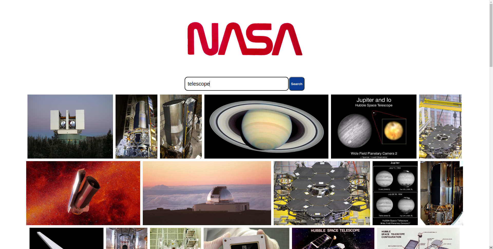
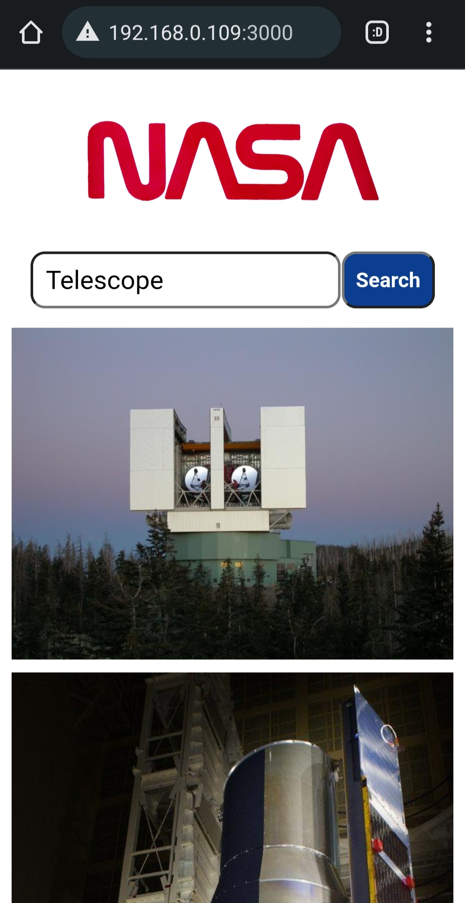

# React Technical Test

This is a react app that enables users to search for images available via the Nasa API.

## Brief

Technical Task - React Developer Role

You are expected to build a React web application that allows users to search for images based on a query relating to space. You are provided the NASA API endpoint for image search.
We want you to consider and add anything to your repository that should be included was this to be a live website.

The following functionalities need to be implemented:
● A Search page which allows users to search for images by keyword
● Images must be returned upon a successful search

The styling is up to you but will be taken into consideration when evaluating your application.

We estimate this task to take ​​10 hours​​. Once you have completed the task upload the repository to GitHub and send the link to xxxxx@xxx.com. ​Deadline: 5 days from receiving.

Relevant API endpoints:

image search:
GET​​ ​​https://images-api.nasa.gov/search ​Params: ​​q

Assets

You may use this asset for your application: https://cdn.cnn.com/cnnnext/dam/asseizingts/200424060716-nasa-worm-logo.jpg

## Screenshots

### Browser View

### Mobile View

## Technologies Used

### Language

- React
- Javascript

### Testing

- Jest
- React Testing Library

### Packages

- Axios
- PropTypes

### Styling

- CSS

## Installation

Clone the repo: `git clone https://github.com/tdot124/tech-test`

`cd` into folder and install dependencies using `npm install`

To start using nasa image search use `npm start`

You can then use the search bar to search for images available via the Nasa API

## What I would do with more time

- Look into different ways of displaying image results to allow for different aspect ratios

- Apply some annimations using CSS when images appear

## Created By

Tom Mills
